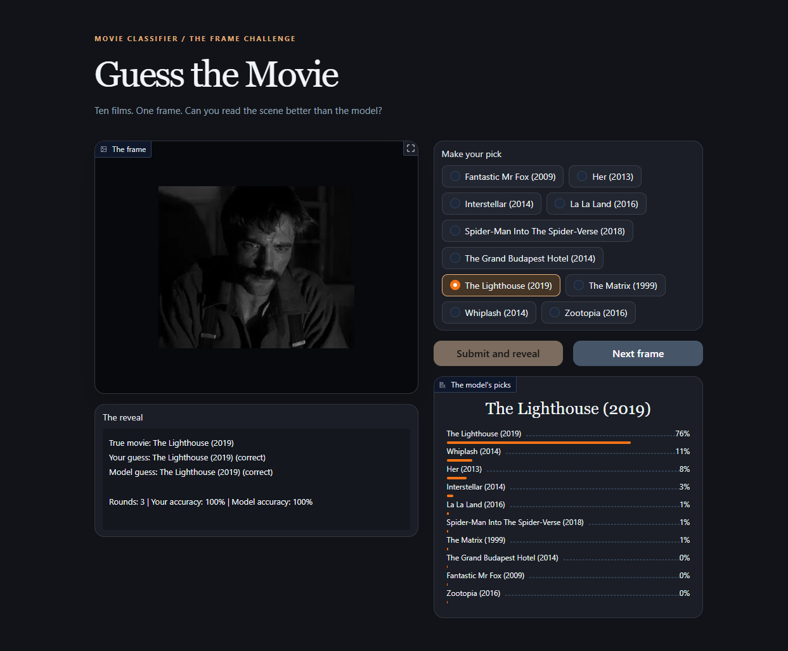
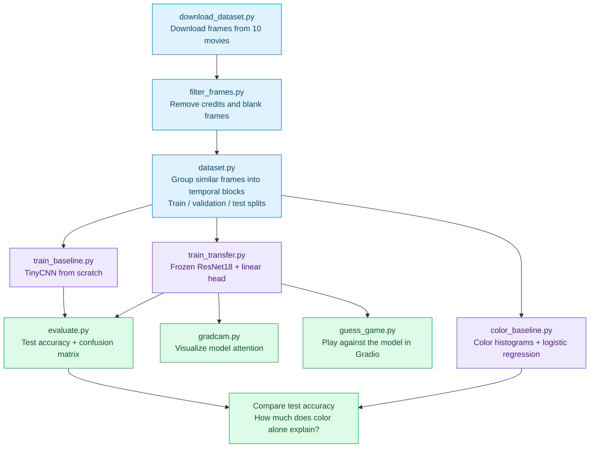

# movie-screenshot-classifier



A CNN that looks at a single frame from a movie and guesses which film it is from. Trained on ten movies with very different visual identities, from the colorful La La Land (my favorite movie of 2016!) to the cold blue of Interstellar to the neon green of The Matrix.

This contains a small pipeline covering dataset curation, a from-scratch baseline, transfer learning, evaluation, and a couple of sanity checks to make sure the model is learning something real.

If you've ever walked by the TV when a movie was halfway through and known exactly what's being played, this project is basically that instinct, turned into a neural network for learning purposes.

## Results

| Model | Test accuracy |
|---|---|
| Color histogram only, no CNN | 72.5% |
| TinyCNN, trained from scratch | 70.7% |
| ResNet18, frozen backbone + linear head | 82.5% |

The color-only baseline scoring close to the from-scratch CNN is a real finding, not a footnote: it means a lot of what a simple model picks up here is color grading, not composition. The transfer model clears both by a wider margin, so it is learning something beyond color.

Why the histogram edges out TinyCNN specifically:

 TinyCNN has to learn its own filters from scratch on about 6,400 training frames, a small dataset for a convolutional network to discover useful spatial patterns in rather than just memorizing noise. 
 
 On a task this color-dominated, TinyCNN likely spends a lot of that limited capacity re-deriving the same color signal the histogram gets for free, with less left over to find anything past it, compared to the histogram which always converges to the same solution. 

## Setup

Requires Python 3.13 and [uv](https://docs.astral.sh/uv/) (much better than PIP!)

```
uv sync
```

## Running the pipeline



All three models use the same splits. Evaluation, Grad-CAM, and the Gradio game use held-out test frames; the latter two load the trained transfer checkpoint.

Each stage is a standalone script, run in this order:

1. **`uv run python download_dataset.py`** downloads frames for the ten chosen movies from Kaggle into `frames/`.

2. **`uv run python filter_frames.py`** deletes opening credits, closing credits, and near-blank frames in place. Destructive, run once per fresh download.

3. **`uv run python train_baseline.py`** trains a tiny CNN from scratch as a floor to beat. Saves `checkpoints/baseline_model.pt`.

4. **`uv run python train_transfer.py`** trains a frozen ResNet18 with a new linear head on top. This is the real model. Saves `checkpoints/transfer_model.pt`.

5. **`uv run python evaluate.py --model transfer`** runs the held-out test set through a checkpoint and writes a confusion matrix plus accuracy to `evaluation_runs/`. Use `--model baseline` for the TinyCNN instead.

6. **`uv run python color_baseline.py`** is the color-only sanity check described above, no CNN involved.

7. **`uv run python gradcam.py`** generates Grad-CAM heatmaps showing which pixels the transfer model actually looked at, saved to `gradcam_runs/`.

8. **`uv run python guess_game.py`** launches a Gradio app at `http://127.0.0.1:7860`. Look at a frame, guess the movie, then see how you stack up against the model.

`dataset.py` is used by the other files: it builds the train, validation, and test split (grouped by clip so near-duplicate frames never leak across splits) and caches the result to `.splits_cache.json` so repeated runs skip the expensive part.

## The movies (Each of them is highly recommended by me!)

- Her (2013)
- Interstellar (2014)
- Fantastic Mr Fox (2009)
- La La Land (2016)
- Spider-Man Into The Spider-Verse (2018)
- The Grand Budapest Hotel (2014)
- The Lighthouse (2019)
- The Matrix (1999)
- Whiplash (2014)
- Zootopia (2016)
